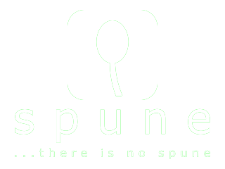

# Spune
Spune is a story-based serious gaming framework designed to facilitate both the creation and playing of serious games. It provides a robust platform for game designers to craft engaging and interactive stories, while offering players an immersive experience.



## Features
### For players
- Engage with story-based games that combine serious content with interactive elements.
- Experience rich media content, including text, images, and interactive elements, seamlessly integrated into the gameplay.
- Navigate through stories and interact with various game elements easily, thanks to an intuitive and responsive user interface.

### For designers
- Design complex, multi-chapter stories with ease. Add text, images, and interactive elements to create engaging narratives.
- Organize stories into chapters, each with its own set of media and interactions.
- Incorporate interactive elements such as quizzes, choices, and tasks to enhance the serious value and engagement of the games.

## Build
To install Spune, clone the repository and build the project using the .NET 9 SDK. To play a game, please ensure that Ollama with Gemma 2 (27B) is also installed. If you want to try the browser version, have a look at the file `nginx.conf` to configure Nginx properly.

```sh
git clone https://gitlab.com/martin.bosgra/spune.git
cd spune
dotnet build
```

## Run the browser app
To run the browser version of Spune, make sure Nginx is configured, and then run the script `launch.sh`. Open your favorite browser and go to the URL http://localhost/index.html.

```sh
cd spune
./launch.sh
```

## Publish
To publish the desktop app for Windows, run the provided script `publish.sh`. The file `publish.zip` will be created.

```sh
cd spune
./publish.sh
```

# Contributing
Contributions are welcome! Please fork the repository and submit pull requests.

# License
This project is licensed under the MIT License.

# Acknowledgements
NHL Stenden: For providing the foundational code and utilities.
Martin Bosgra: Author and primary maintainer of the project.